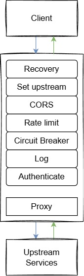

+++
title = '使用 GO 實作簡單的 API Gateway'
date = 2026-04-08T22:59:03+08:00
draft = false
description = '簡單實作 API Gateway，依照 config.yaml 將 Request 反向代理給其他服務，並有 Rate limit、JWT 驗證、Log、metrics 等功能'
toc = true
tags = ['GO']
categories = ['GO']
+++

簡單實作 API Gateway，依照 config.yaml 將 Request 反向代理給其他服務，並有 Rate limit、JWT 驗證、Log、metrics 等功能
# 架構
\
接收到 Client 發送的 Request 後，經過多個 middleware，然後到達 proxy handler，依照 config.yaml 反向代理至指定的 upstream services
- `main.go`：使用責任鏈模式組裝 handler + middlewares，啟動 HTTP server 與 metrics/health endpoints
- `handler/proxy.go`：專案基本功能，Reverse Proxy 到 upstream
- `handler/health.go`：檢查健康狀態
- `middleware/*`：專案的額外功能都由 middleware 實現，在 Request 進來時及 Response 出去時，實現限流、Log、斷路器和 JWT 驗證等功能
- `helper/*`：各種 middleware 的輔助 function
- `logger/logger.go`：zap logger + lumberjack rotation
此外還有 `/metrics` 回傳 Prometheus metrics

## ReverseProxy
```go
// upstream url
url := "http://order.example.com"
proxy := httputil.NewSingleHostReverseProxy(url)
proxy.ServeHTTP(w, r)
```
在 config.yaml 中定義 request path 轉發給哪個 upstream，例如：
- `/order/*` -> `http://order.example.com`
- `/user/*` -> `http://user.example.com`

## Metric
除 prometheus package 自帶的 Go runtime metric collector 和 process metric collector 外，額外定義三個 metric collector：
- `gateway_requests_total{upstream,operation,uri}`：記錄 rate limit 接受（accept）和拒絕（reject）了多少 request。counter
- `http_requests_total{upstream,method,code,uri}`：總共收到多少 request。counter
- `http_request_duration_seconds{upstream,uri}`：request 持續多少時間，以秒計算。histogram，下邊界 0.1，factor 5，共 6 個 bucket
- `circuit_breaker_open{upstream}`：斷路器斷開次數

## Middleware
### Recovery
為最開始的 middleware，防止其他 middleware 或 proxy panic 導致整個服務掛掉\
recovery 時，logger 會記錄 error，然後 JSON response 500 Internal Server Error
```go
return http.HandlerFunc(func(w http.ResponseWriter, r *http.Request) {
    defer func() {
        if err := recover(); err != nil {
            logger := logger.NewLogger()
            logger.Error(
                "Panic recovered.",
                zap.String("err", fmt.Sprintf("%v", err)),
            )
            helper.JSONResponse(w, http.StatusInternalServerError, map[string]string{}, map[string]string{
                "msg": "Internal Server Error",
            })
        }
    }()

    m.next.ServeHTTP(w, r)
})
```
### Upstream
從 request url 解析出對應的 upstream，然後將對應的 config 塞進 request context 中，找不到對應的 upstream 則回傳 404
```go
# helper
type upstreamContextKey struct{}
var upstreamCtxKey upstreamContextKey
func WithUpstream(ctx context.Context, upstream *Upstream) context.Context {
	return context.WithValue(ctx, upstreamCtxKey, upstream)
}

# upstream middleware
return http.HandlerFunc(func(w http.ResponseWriter, r *http.Request) {
	upstreamKey := upstreamKeyFromRequestPath(r.URL.Path)
	upstream, ok := helper.Upstreams[upstreamKey]
	if ok {
		r = r.WithContext(helper.WithUpstream(r.Context(), &upstream))
		m.next.ServeHTTP(w, r)
		return
	}
	http.NotFound(w, r)
})
```
### CORS
設置 CORS 相關 response header。如果為 preflight request，則回傳 204 No Content
### Rate Limit
因為 API Gateway 可能有突發高峰的情況，所以使用實作 Token bucket 的 [time/rate](https://pkg.go.dev/golang.org/x/time/rate)，而非 Leaky bucket\
這邊簡單選擇每 1 個 request 佔用 1 個 token 的方式，沒有依照 bytes 去佔用 token\
根據 config.yaml 設定 token bucket 每秒放入多少 token 以及上限\
rate limit 接受和拒絕都會記錄 metric\
拒絕時回傳 429，header 包含 retry after，表示要等待多久才會有 token 能用
```go
return http.HandlerFunc(func(w http.ResponseWriter, r *http.Request) {
	upstream := helper.GetUpstream(r.Context())
	reservation := m.getLimiter(upstream).Reserve()
	if !reservation.OK() {
		// 記錄 reject metric
		helper.GatewayRequestTotal.WithLabelValues(upstream.Name, "reject", r.URL.Path).Inc()
		// 回傳 429，header 包含 retry after，表示要等待多久才會有 token 能用
		helper.JSONResponse(
			w,
			http.StatusTooManyRequests,
			map[string]string{
				"Retry-After": strconv.Itoa(int(math.Ceil(reservation.Delay().Seconds()))),
			},
			map[string]string{
				"msg": "Too Many Requests",
			},
		)
		return
	}
	// 記錄 accept metric
	helper.GatewayRequestTotal.WithLabelValues(upstream.Name, "accept", r.URL.Path).Inc()
	m.next.ServeHTTP(w, r)
})
```
### Circuit Breaker
斷路器實作參考 [Martin Fowler 的這篇文章](https://martinfowler.com/bliki/CircuitBreaker.html)\
這邊簡單設定 upstream response status code >= 500 超過 5 次時，斷路器開啟 30 秒。30 秒後斷路器半開，新的 request 進來時，進行試探性呼叫 upstream，成功的話斷路器閉合，恢復反向代理\
因為有多個 request，所以失敗次數、最後失敗時間，以及試探性呼叫都利用 `atomic` 實現 lock
```go
# helper
type CircuitBreaker struct {
	failureCount     atomic.Uint32
	failureThreshold uint32
	resetTimeout     time.Duration
	lastFailureTime  atomic.Pointer[time.Time]
	halfOpenInFlight atomic.Bool
}

func (c *CircuitBreaker) GetState() CircuitBreakerState {
	if c.failureCount.Load() < c.failureThreshold {
		return Closed
	}

	lastFailureTime := c.lastFailureTime.Load()
	if lastFailureTime == nil {
		return Open
	}

	if time.Since(*lastFailureTime) > c.resetTimeout {
		return HalfOpen
	}
	return Open
}

func (c *CircuitBreaker) Reset() {
	c.failureCount.Store(0)
	c.lastFailureTime.Store(nil)
	c.halfOpenInFlight.Store(false)
}

func (c *CircuitBreaker) RecordFailure() {
	c.failureCount.Add(1)
	now := time.Now()
	c.lastFailureTime.Store(&now)
}

func (c *CircuitBreaker) TrialCallStart() bool {
	return c.halfOpenInFlight.CompareAndSwap(false, true)
}

func (c *CircuitBreaker) TrialCallOver() {
	c.halfOpenInFlight.Store(false)
}
```
回到 middleware\
斷路器開啟，或者半開且未取得試探性呼叫的 lock 時，記錄 metric，然後回傳伺服器忙碌的 Response\
斷路器閉合，或半開且成功取得試探性呼叫的 lock 時，允許呼叫 upstream。如果 upstream 回傳 stauts code >=500，記錄失敗次數及時間，否則重置斷路器\
斷路器半開時，會設定 defer function 釋放 lock
```go
# middleware
return http.HandlerFunc(func(w http.ResponseWriter, r *http.Request) {
	upstream := helper.GetUpstream(r.Context()).Name
	circuitBreaker := m.CircuitBreakers[upstream]
	if circuitBreaker == nil {
		m.next.ServeHTTP(w, r)
		return
	}

	state := circuitBreaker.GetState()
	if state == helper.Open {
		// 記錄斷路器開啟次數
		helper.CircuitBreakerOpen.WithLabelValues(upstream).Inc()
		// 回傳伺服器忙碌的 Response
		helper.JSONResponse(
			w,
			http.StatusServiceUnavailable,
			map[string]string{},
			map[string]string{"msg": "Server is overloaded. Please try later."},
		)
		return
	}

	// 斷路器半開且未取得試探性呼叫的 lock
	if state == helper.HalfOpen && !circuitBreaker.TrialCallStart() {
		helper.CircuitBreakerOpen.WithLabelValues(upstream).Inc()
		// 回傳伺服器忙碌的 Response
		helper.JSONResponse(
			w,
			http.StatusServiceUnavailable,
			map[string]string{},
			map[string]string{"msg": "Server is overloaded. Please try later."},
		)
		return
	}

	if state == helper.HalfOpen {
		defer circuitBreaker.TrialCallOver()
	}

	// 斷路器閉合，或半開且成功取得試探性呼叫的 lock 時，允許呼叫 upstream
	rw := helper.NewResponseWriter(w)
	m.next.ServeHTTP(rw, r)

	if rw.StatusCode >= http.StatusInternalServerError {
		// upstream 回傳 status code >= 500 時，斷路器記錄失敗次數及時間
		circuitBreaker.RecordFailure()
		return
	}

	// 重置斷路器
	circuitBreaker.Reset()
})
```
### Log
記錄 request 和 response log，一個 request 對應的 response 會有同一個 trace_id 方便追蹤\
因為沒辦法直接從 http.ResponseWriter 取得 http status code 或 content，所以參考[這篇 SO 回答]([https://stackoverflow.com/questions/66528234/log-http-responsewriter-content](https://stackoverflow.com/a/66531582/11976231))，建立一個 struct embedding http.ResponseWriter，然後把 status code 和 content 設為 export field
```go
import "net/http"

type ResponseWriter struct {
    http.ResponseWriter
    StatusCode int
	Body []byte
}

func (r *ResponseWriter) WriteHeader(code int) {
    r.StatusCode = code
    r.ResponseWriter.WriteHeader(code)
}

func (r *ResponseWriter) Write(b []byte) (int, error) {
	r.Body = b
    return r.ResponseWriter.Write(b)
}

func NewResponseWriter(w http.ResponseWriter) *ResponseWriter {
	return &ResponseWriter{ResponseWriter: w}
}
```
### Authenticate
取得 request 的 JWT，然後使用 app key（即 JWT secret）驗證簽名\
根據取得的 claim 決定處理動作：
1. 解析 JWT 失敗，JWT 缺失、驗證不通過或沒有過期時間，回傳 401
2. JWT 過期，回傳 403
3. JWT scope 與 upstream 服務不合，回傳 403
4. JWT 驗證成功，在 request header 設定 UserId、Email、Scope 然後通過此 middleware，讓 upstream 不用重複解析 JWT
```go
return http.HandlerFunc(func(w http.ResponseWriter, r *http.Request) {
	upstream := helper.GetUpstream(r.Context())
	if upstream != nil && upstream.Auth {
		userClaim, ok := m.getUserClaim(r)
		if !ok {
			helper.JSONResponse(w, http.StatusUnauthorized, map[string]string{}, map[string]string{
				"msg": "Unauthorized",
			})
			return
		}
		if userClaim.ExpiresAt.Compare(time.Now()) == -1 {
			helper.JSONResponse(w, http.StatusForbidden, map[string]string{}, map[string]string{
				"msg": "Token expired",
			})
			return
		}
		if !slices.Contains(strings.Split(userClaim.Scope, ","), upstream.Name) {
			helper.JSONResponse(w, http.StatusForbidden, map[string]string{}, map[string]string{
				"msg": "Forbidden",
			})
			return
		}
		m.setClaimToHeader(userClaim, r)
	}
	m.next.ServeHTTP(w, r)
})
```
# 後記
這算是儘量用標準庫或標準擴展庫寫出來的簡單專案，其中還有不少可以優化的地方，例如 reload config、Rate Limit 用 byte 佔用 token、支援其他網路協定等\
但也學到了以前沒聽過的一些概念，例如限速和斷路器。同時也震驚 http.ResponseWriter 無法直接取得 http status code 這件事，每次想到都很震驚（。\
最後，完整的 code 可以參考我的 [Github repository](https://github.com/FallPrediction/api-gateway)
