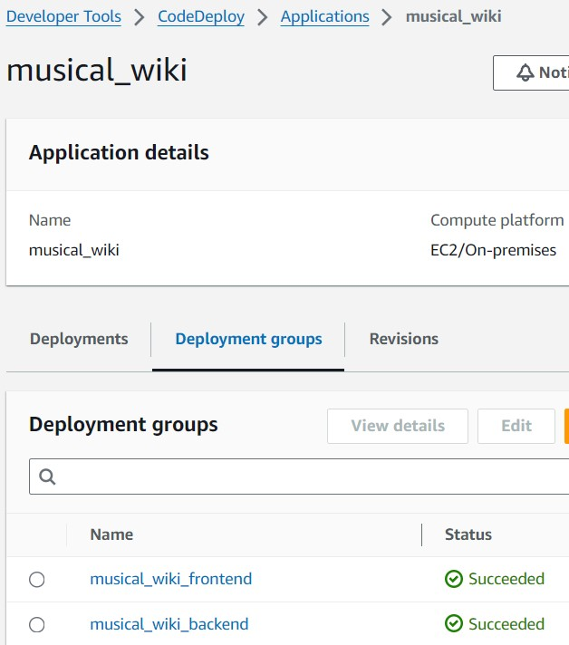
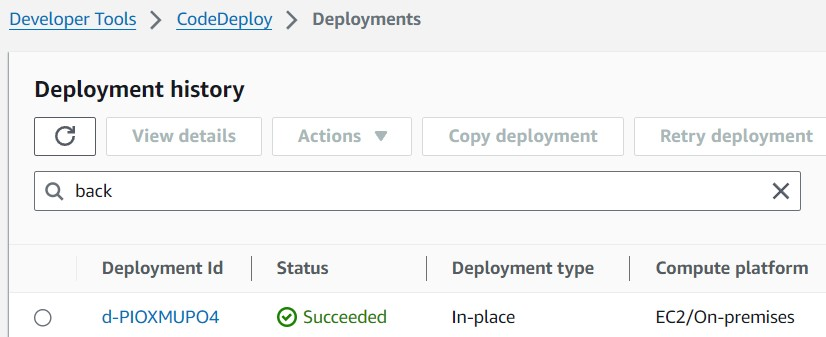

+++
title = 'CodeDeploy部署GO APP 到EC2'
date = 2024-02-04T12:20:33+08:00
draft = false
description = '免費好用的CodeDeploy讓你快速部署GO APP'
toc = true
tags = ['AWS']
categories = ['AWS']
+++

## 前言
去年跟主管聊天的時候，聊到如何部署code到EC2上面的問題。他推薦Code Deploy給我，容易上手而且不用付費，非常適合我。

當時懵懵懂懂的我把這個專有名詞記下了，不久主管就離職了((炸

總之，時隔N個月終於我終於開始學習CodeDeploy，不同的是這時我正好也在學習GO，想說來學著部署一個GO程式吧

眾所皆知，學習一個東西最好的方式就是看官方文件，除非他文件寫很爛

這篇只有介紹個人認為的重點、有用到的功能和踩過的坑，詳細內容還是要看官方文件喔！

## 部署平台、部署類型、部署設定
可以部署的平台有三種：
- EC2/On-Premises(地端)
- AWS Lambda
- Amazon ECS

部署類型有兩種：
- In-place deployment：看英文就知道就是把原本的服務換了。會停止部署群組(deployment group)的應用程式，更新以後再啟動。只能在EC2/On-Premises 平台上使用
- 藍綠部署：上述的三種平台都能用。在EC2/On-Premises，會把deployment group裡面的實例按比例更新替換，直到全部換成新版

部署設定有三種：
- AllAtOnce：一次更新盡可能多的instance。當**其中一個instance** 更新成功，則視為整體部署成功；只有全部instance部署失敗，才視為整體部署失敗
- HalfAtATime：一次更新一半數量（無條件捨去）的instance。當一半數量（無條件進位）更新成功，則視為整體部署成功
- OneAtATime：一次更新一個instance。當除了最後一個以外的instance 更新成功，則視為整體部署成功

## 在EC2 上部署
這邊講的都是EC2 上In-place 部署的內容，其他平台和類型內容可能會不一樣

### 先決條件
如果使用S3 儲存application revision，該bucket與deployment group 中的instance 必須位於相同的region

application revision指應用程式要被部署的版本，在EC2/On-premises平台，就是來源內容（source code, script等）以及AppSpec檔（和它用到的script）

### IAM role權限
用Code Deploy 在EC2 上部署，IAM需要相關的權限，因此可以建立一個Role，指定好Policy然後給予EC2 instace
需要綁定的policy有：
- AmazonS3ReadOnlyAccess：因為EC2/On-premises需要從S3拉source content
- AWSCodeDeployRole
- AmazonSSMManagedInstanceCore：因為要使用SSM安裝CodeDeploy agent

### 流程


### Deployment group
可以用EC2 instance tag 或Auto scaling name 或兩者都用，code deploy 用這個決定要部署到哪裡

每個EC2 instance 必須安裝CodeDeploy agent，也可以在建立Deployment group 時指定用Systems Manager(SSM)安裝

建立Deployment group 之前，要先建立Application，然後在裡面建立一到多個Deployment group，各個group 在指定EC2 instance 的tag

舉例來說，我有一個專案，前後端分離。首先建立Application叫這個專案的名字，然後建立兩個Deployment group，分別是backend 和frontend。backend 和frontend 各自指定用tag篩選要部署的EC2 instance（當然可以都是同樣的機器，當個省錢小達人）



建立Deployment group的時候，會詢問要選擇哪種部署類型（In-place 或藍綠）、環境配置（Auto Scaling、EC2、On-Premises，可多選）、部署設定，還有是否啟用Load Balancer

### appspec
Deployment有一系列的[生命週期事件](https://docs.aws.amazon.com/codedeploy/latest/userguide/reference-appspec-file-structure-hooks.html#appspec-hooks-server)，而AppSpec 可以指定哪個hook要做哪些事情，例如執行script

appspec.yml 必須在source code的根目錄中，否則會部署失敗。格式請參考[文件](https://docs.aws.amazon.com/codedeploy/latest/userguide/reference-appspec-file.html#appspec-reference-server)

appspec.yml長類似這樣：
```yaml
version: 0.0
os: linux
files:
  - source: /
    destination: /var/www/html/WordPress
hooks:
  BeforeInstall:
    - location: scripts/install_dependencies.sh
      timeout: 300
      runas: root
  AfterInstall:
    - location: scripts/change_permissions.sh
      timeout: 300
      runas: root
  ApplicationStart:
    - location: scripts/start_server.sh
    - location: scripts/create_test_db.sh
      timeout: 300
      runas: root
  ApplicationStop:
    - location: scripts/stop_server.sh
      timeout: 300
      runas: root
```

source表示要複製什麼檔案到destination位置

假設包到S3的revision長這樣：
```
/
  |-- appspec.yml  
  |-- scripts/
  |    |-- change_permissions.sh
  |    |-- create_test_db.sh
  |    |-- install_dependencies.sh
  |    |-- start_server.sh
  |    |-- stop_server.sh
  |-- index.php
```

那麼source可以指定單檔案(如index.php)，或目錄(如scripts)，或單斜線`/`表示整包revision

destination 表示要複製到目的地的**檔案位置**，不包含檔案名稱

### 準備要部署的GO APP revision
範例Code可以參考[我的Github Repo](https://github.com/FallPrediction/musical_wiki_backend)

GO部署的好處就是可以包成一個編譯後的二進制檔案

這裡使用systemctl讓GO APP 作為一個服務開啟和關閉
```
[Unit]
Description=Musical wiki service
After=network.target

[Service]
User=root
WorkingDirectory=/var/app
ExecStart=/var/app/musical_wiki
Restart=always

[Install]
WantedBy=multi-user.target
```

然後在專案根目錄加入appspec.yml
```yaml
version: 0.0
os: linux
files:
  - source: /
    destination: /var/app/
    file_exists_behavior: OVERWRITE
  - source: deployments/codeDeploy/musical_wiki.service
    destination: /etc/systemd/system
    file_exists_behavior: OVERWRITE

hooks:
  AfterInstall:
    - location: deployments/codeDeploy/scripts/change_permissions.sh
    - location: deployments/codeDeploy/scripts/update_env.sh
      timeout: 120
      runas: root
  ApplicationStart:
    - location: deployments/codeDeploy/scripts/start_app.sh
      timeout: 120
      runas: root
```

files中，將整個專案內容覆蓋到/var/app，然後systemctl service file覆蓋到/etc/systemd/system

然後指定兩個hook事件，安裝完畢後，修改permissions，還有更新.env file；另一個是ApplicationStart，用systemctl restart 重啟服務

hook的location指定script在專案中的目錄即可

將上述內容壓縮，丟到S3上。整個壓縮的目錄會長這樣：
```
.
├── musical_wiki
├── appspec.yml
├── main.tf
└── deployments/
    └── codeDeploy/
        └── scripts/
            ├── change_permissions.sh
            ├── update_env.sh
            └── start_app.sh
```

### Deployment
終於到部署環節了！

上面建立了Application 和Deployment group ，就可以在group裡面建立Deployment開始部署了

建立Deployment的時候，需要指定剛才整包revision丟到S3上的地址，例如`s3://bucket-name/folder/object.[zip|tar|tgz]`

建立完成後，CodeDeploy會開始在EC2 instance 上部署，到console就可以看到成果了


