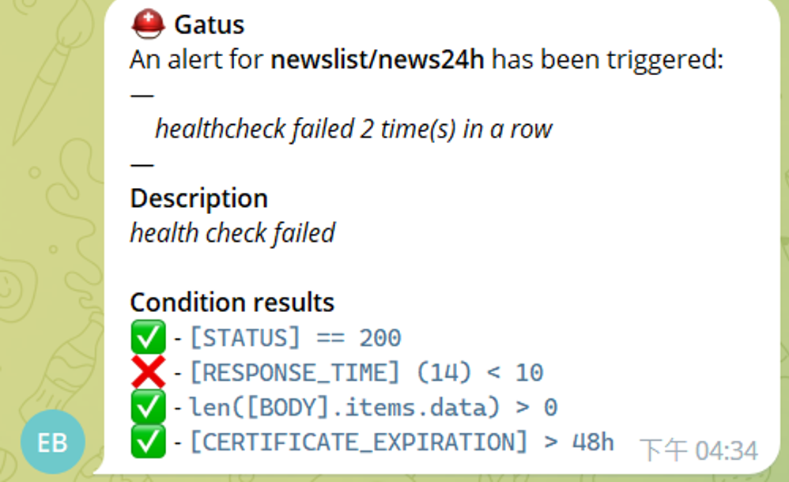
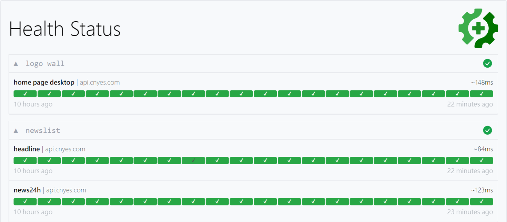

+++
title = 'Gatus'
date = 2022-12-07T15:41:17+08:00
lastmod = 2024-04-26T15:41:17+08:00
draft = false
description = '一款簡單、方便設置的監控服務'
toc = true
tags = ['Monitoring', 'Alerting']
categories = ['Monitoring', 'Alerting']
+++

## Gatus的功能


先簡單列點Gatus的功能（部分選項省略）：
- Health dashboard監控服務健康狀態
  - HTTP
  - ICMP
  - TCP
  - DNS
- 自定義健康狀態條件
- 儲存監控紀錄
  - PostgreSQL
- 儀錶板
- 告警通知
  - Slack
  - Telegram
  - Email

等等，這些功能Prometheus + Grafana 不都有嗎？

確實，講到監控、告警，最常聽到的就是Prometheus + Grafana的王道組合了

但對一些小公司或小專案，這個王道組合有點太大了。我記憶力非常堪憂，剛學的東西，兩個禮拜後記住的比例斷崖式下降，尤其是PromQL真的很難背，也不常用

這時候[Gatus](https://github.com/TwiN/gatus)的優勢就出來了

首先，啟動速度非常快，自帶儀錶板，簡單設定一個config.yaml就能用了

再來它還有一個特點，它是主動發起請求。Prometheus是拉取機器的資料，沒有被呼叫的服務當然也不會有資料。Gatus這種作法可以主動檢查例如API等等服務是否有問題，避免被使用的那一刻才爆炸

我前公司有一些平常沒在用的API，DevOps也無力架設相關的系統，Gatus這種小巧的監控真的非常適合

## 設定config
Gatus的文件真的寫得非常詳細、容易理解。這裡簡單列出我比較會用到的功能：
- 監控endpoints列表
- name
- url
- interval：間隔多久呼叫一次
- conditions：符合這些條件才算通過
  - HTTP status code
  - Response time
  - Body的結構，是否存在key，array長度等等
  - Certificate是否即將過期
  - Domain是否即將過期

config.yaml
```yaml
endpoints:
- group: newslist
  name: news24h
  url: https://api.cnyes.com/media/api/v1/newslist/category/news24h
  interval: 30m
  conditions:
    - "[STATUS] == 200"
    - "[RESPONSE_TIME] < 1000"
    - "len([BODY].items.data) > 0"
    - "[CERTIFICATE_EXPIRATION] > 48h"
```

重複的內容太多，看得眼花撩亂？既然config是yaml格式，當然也可以用yaml的繼承
```yaml
# 先寫一個基本設定，&名稱
endpoint-200: &endpoint-200
  conditions:
    - "[STATUS] == 200"
    - "[RESPONSE_TIME] < 1000"

# 來繼承它！<<: *名稱
endpoints:
  - grouop: logo wall
    name: adContents
    url: https://api.cnyes.com/media/api/v1/adContents/Home_float_btn_D
    interval: 30m
    <<: *endpoint-200
```

## 告警
官方有提供一卡車的告警通知串接方案，小專案的話，使用Telegram很方便
告警可以簡單設定下列內容：
- 告警訊息
- send-on-resolved：是否觸發警報後後續不再告警
- failure-threshold：需要連續幾次檢查不通過才告警

可以設定多種告警，然後在endpoints裡面的alerts陣列指定告警通知

config.yaml
```yaml
alerting:
  telegram:
    token: ${TELEGRAM_TOKEN}
    id: ${TELEGRAM_CHAT_ID}
    default-alert:
      enabled: true
      description: "health check failed"
      send-on-resolved: true
      failure-threshold: 2
endpoints:
  - group: newslist
    name: news24h
    url: https://api.cnyes.com/media/api/v1/newslist/category/news24h
    interval: 30m
    conditions:
      - "[STATUS] == 200"
      - "[RESPONSE_TIME] < 1000"
      - "len([BODY].items.data) > 0"
      - "[CERTIFICATE_EXPIRATION] > 48h"
    alerts:
      - type: telegram
```
看到的告警訊息會長這樣


## 部署
官方提供K8S, Docker和Terraform等等部署方式

這邊紀錄Docker的啟動方式，官方有提供image非常方便！
compose.yaml
```yaml
version: "3.8"
services:
  gatus:
    image: twinproduction/gatus:latest
    ports:
      - 80:8080
    volumes:
      - ./config:/config
    restart: always
    stop_signal: SIGINT
    stop_grace_period: 10s
    environment:
      - TELEGRAM_TOKEN=${TELEGRAM_TOKEN}
      - TELEGRAM_CHAT_ID=${TELEGRAM_CHAT_ID}
```

## 儀錶板
上面的compose映射了80 port，打開http://localhost:80看看儀錶板吧

### 監控首頁

可以看到有下列訊息：
- 群組名稱
- endpoint名稱
- 平均回應時間
- 從舊到新顯示最近的檢查結果
  - 綠色：正常
  - 紅色：檢查不合格

### 監控內頁
點擊進入各個endpoint，可以看到更詳細的內容和圖表
- 時間軸顯示回應時間
- 最新健康狀態
- 最近事件
  - 監控開始日期
  - 監控有問題的日期
  - 回復正常的日期

## 參考
- https://github.com/TwiN/gatus
- https://blog.wu-boy.com/2022/03/automated-service-health-dashboard-gatus/

## 範例Code
[我的Repo](https://github.com/FallPrediction/gatus)
