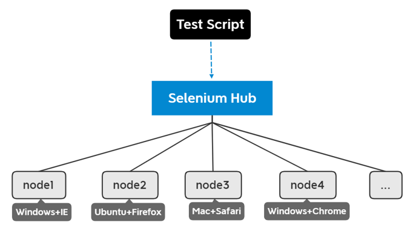
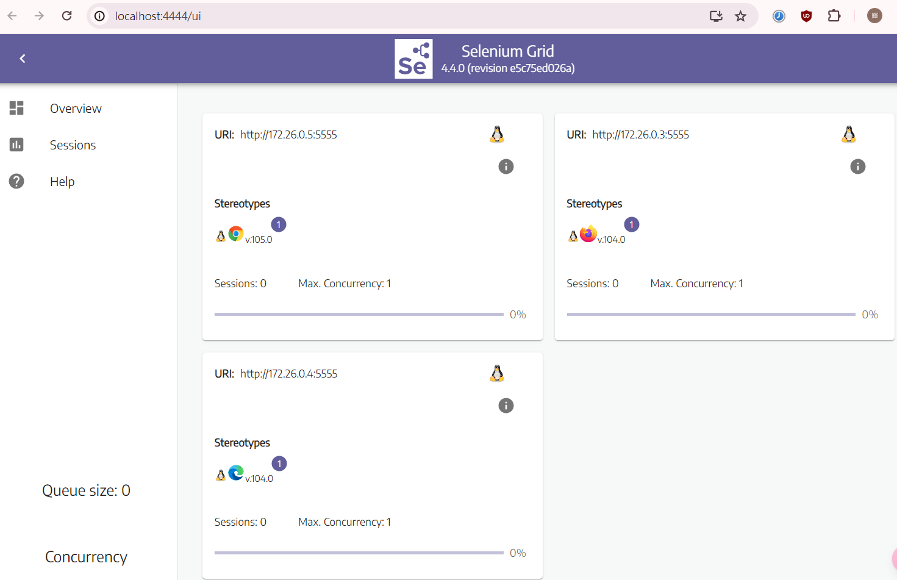

+++
title = '簡單介紹Selenium Grid'
date = 2022-09-21T23:11:49+08:00
draft = false
description = '讓一個測試在多種不同的瀏覽器上測試'
toc = true
tags = ['Test']
categories = ['Test']
+++

## 用途
Selenium Grid可以讓一個測試在不同機器上的瀏覽器執行測試

一個測試發到Hub，然後發給適合的Node執行。每個Node可以是不同作業系統、不同瀏覽器，瀏覽器也可以是不同版本


[圖片來源](https://www.cnblogs.com/yaner2018/p/16166023.html)

## 組件
官方文件中有一張組件圖


先了解WebDriver session定義，再看組件會比較清楚~
[W3C的文件](https://www.w3.org/TR/webdriver1/#sessions)中，寫道下面這句:
> A WebDriver session represents the connection between a local end and a specific remote end.(https://w3c.github.io/webdriver/#dfn-session)
用中文簡單來說，就是本地端和特定遠端之間的連接

Selenium Grid擁有六種組件：
- Node：執行session，一個grid可有多個nodes，每個node可以是不同的作業系統
- Session Queue：以queue的形式維護session
- Distributor：將session分配給合適的Node執行
- Session Map：紀錄session id和Node的關係
- Event Bus：負責以上四種組件的溝通
- Router：接收所有請求並發給組件

當Router收到一個新的session request，它將被轉發到Session Queue

之後Distributor會從Session Queue取得session然後發給適合的Node執行，然後在Session Map紀錄sessionID和執行的Node

如果是已存在的session，Router會查詢Session Map取得正在運行session的Node ID，然後將request直接轉發到 Node，不會再轉給Session Queue。

## Grid Roles
有三種不同的部屬方式，可以根據自身的需要選擇合適的方式
- Standalone：全部組件在同一台機器
- Hub and Node：除了Node，其餘組件組成Hub，Hub和Node各自啟動，可以是不同機器
- Distributed：每個組件各自啟動，可以是不同機器

## 使用Docker啟動Selenium grid
開發環境非常適合使用Docker啟動環境，這個[Docker Selenuim](https://github.com/SeleniumHQ/docker-selenium)可以非常方便的用compose.yaml一次啟動Hub和多個不同瀏覽器的Node

compose.yaml
```yaml
version: "3"
services:
  chrome:
    image: selenium/node-chrome:latest
    shm_size: 2gb
    depends_on:
      - selenium-hub
    environment:
      - SE_EVENT_BUS_HOST=selenium-hub
      - SE_EVENT_BUS_PUBLISH_PORT=4442
      - SE_EVENT_BUS_SUBSCRIBE_PORT=4443
    ports:
      - 7900:7900

  edge:
    image: selenium/node-edge:latest
    shm_size: 2gb
    depends_on:
      - selenium-hub
    environment:
      - SE_EVENT_BUS_HOST=selenium-hub
      - SE_EVENT_BUS_PUBLISH_PORT=4442
      - SE_EVENT_BUS_SUBSCRIBE_PORT=4443
    ports:
      - 7901:7900

  firefox:
    image: selenium/node-firefox:latest
    shm_size: 2gb
    depends_on:
      - selenium-hub
    environment:
      - SE_EVENT_BUS_HOST=selenium-hub
      - SE_EVENT_BUS_PUBLISH_PORT=4442
      - SE_EVENT_BUS_SUBSCRIBE_PORT=4443
    ports:
      - 7902:7900

  selenium-hub:
    image: selenium/hub:latest
    container_name: selenium-hub
    ports:
      - "4442:4442"
      - "4443:4443"
      - "4444:4444"
```

Hub開啟4444port，到時候測試用4444port跟grid連接。4442和4443port是給Event Bus使用，一個是發佈、一個是訂閱

如果需要監看瀏覽器操作流程，就要開啟port對應node 7900port。上述的compose.yaml中，chrome開啟7900，edge開啟7901等。如果不需要監看就不必開啟

`docker-compose up –d`起環境以後，進入 http://localhost:4444/ui 檢查狀態


也可以`curl GET 'http://localhost:4444/status'`檢查狀態

## 寫一個測試
這裡拿上一篇文章的測試，不過這次我改用pytest，因為比較方便！

這個測試用fixture建立一個chrome webdriver，打開鉅亨網，然後將游標懸停在導航欄的新聞上，最後assert在頁面上看到「台股盤勢」四個字
```python
import pytest
from selenium import webdriver
from selenium.webdriver import ActionChains
from selenium.webdriver.common.by import By


@pytest.fixture(scope="module")
def driver():
    driver = webdriver.Chrome()
    driver.maximize_window()
    yield driver
    driver.quit()

def test_search_in_python_org(driver):
    driver.get("https://www.cnyes.com/")
    elem = driver.find_element(
        by=By.CSS_SELECTOR,
        value='nav ul li a[data-global-ga-label="新聞"]>span'
    )
    ActionChains(driver).move_to_element(elem).perform()
    assert "台股盤勢" in driver.page_source
```

現在搭配Selenium grid，webdriver必須改為remote，因為要連接Hub
```python
@pytest.fixture(scope="module")
def driver():
    driver = webdriver.Remote(
        command_executor='http://localhost:4444',
        options=webdriver.ChromeOptions()
    )
    driver.maximize_window()
    yield driver
    driver.quit()
```

修改後，我們來監看瀏覽器的操作狀況。在compose.yaml有映射7900 port，所以連接到http://localhost:7900/，可以看到這個畫面

點擊「連線」後，輸入密碼（預設密碼是`secret`）
回到command line，就可以開始測試，並且監看操作狀況啦！
```
pytest
```

## 在不同的瀏覽器測試
在上面的測試裡，只用了Chrome瀏覽器測試。如果想要在一個測試中指定多種瀏覽器的option，可以使用pytest parametrizing fixtures
```python
def create_options(browser_name):
    if browser_name == 'firefox':
        options = webdriver.FirefoxOptions()
    elif browser_name == 'edge':
        options = webdriver.EdgeOptions()
    else:
        options = webdriver.ChromeOptions()
    return options

@pytest.fixture(scope="module", params=['chrome', 'edge', 'firefox'])
def driver(request):
    driver = webdriver.Remote(
        command_executor='http://localhost:4444',
        options=create_options(request.param)
    )
    driver.maximize_window()
    yield driver
    driver.quit()
```

在fixture加上params參數，是測試的瀏覽器list。當執行driver這個function時，request.param會按照順序取得chrome, edge, firefox。又新增了create_options function，依照傳入的瀏覽器名稱回傳options

## 並行測試
可以使用pytest-xdist，讓它用多個CPU加速處理多個測試
```
pytest –n 3
```

## 參考
- https://www.selenium.dev/documentation/grid/
- https://github.com/SeleniumHQ/docker-selenium
- https://www.cnblogs.com/yaner2018/p/16166023.html

## 範例Code
[我的Repo](https://github.com/FallPrediction/selenium-grid-example)
