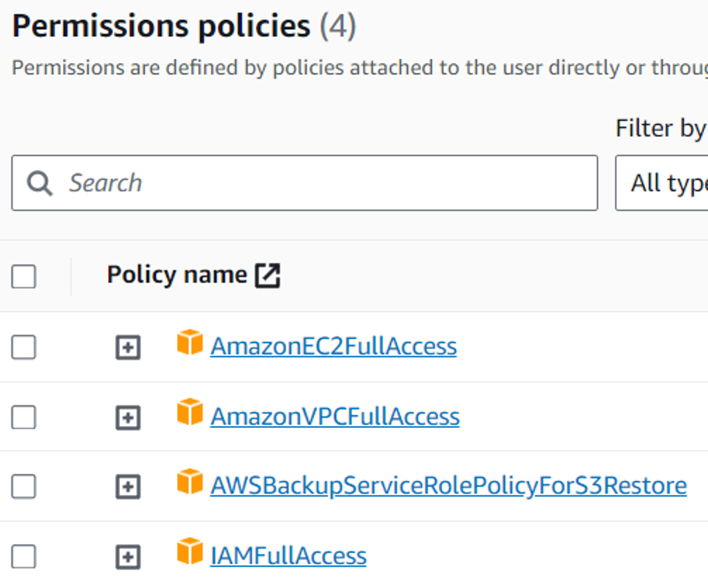

+++
title = '用Terraform舒適管理Infrastructure'
date = 2023-11-26T20:20:26+08:00
draft = false
description = '用Terraform舒適管理Infrastructure'
toc = true
tags = ['Infra']
categories = ['Infra']
+++

## 前言
你是否有以下困擾？
- 花了10分鐘從圖形介面建資源
- 再花10分鐘刪資源
- 刪除資源後想重建但不記得架構了
- 橫跨多雲的複雜架構

你需要Terraform！

Terraform是一個IaC(Infrastructure as Code)工具，可以用簡單易讀的設定檔，建立許多Provider，如AWS、GCP等，提供的資源

還可以快速建立或快速銷毀，Provider會自動計算依賴關係，按照順序建立或刪除

更好的是可以進版控，方便追蹤修改的歷史


這麼~~偷懶~~便利的東西，簡直是工程師的心頭好啊

## Terraform的檔案種類
### main.tf
main.tf是主要的entrypoint，用來指定data, resource等等

data
- 格式：`data <type> <name>`
- 引用：`data.<type>.<name>.<attribute>`

resource
- 格式：`resource <type> <name>`
- 引用：`<resource type>.<name>.<attribute>`

範例：
main.tf
```tf
terraform {
  required_providers {
    aws = {
      source  = "hashicorp/aws"
      version = "~> 5.2"
    }
  }

  required_version = ">= 1.4"
}

provider "aws" {
  region = "ap-south-1"

  default_tags {
    tags = {
      Creator     = "FallPrediction"
      Environment = "Prod"
      Service     = "Musical wiki"
    }
  }
}

data "aws_availability_zones" "available" {
  state = "available"
}

resource "aws_instance" "app_server" {
  ami                    = "ami-830c94e3"
  instance_type          = "t3a.nano"
  availability_zone      = data.aws_availability_zones.available.names[0]
}

resource "aws_eip" "app_server_ip" {
  instance = aws_instance.app_server.id
  domain   = "vpc"
}
```

provider version最大5.2，指定aws provider的region為孟買，然後加上一個default_tags讓下面的資源全部打上相同的tag

取得aws_availability_zones的資料，並命名為available，並且參數是state = available。引用data aws_availability_zones的available的屬性names然後取得第0個

建立一個叫app_server的aws_instance resource，參數指定了ami和instance_type，和剛才說的availability_zone

resource要引用aws_instance app_server的屬性id

### variables.tf
使用變數的話，就可以根據需要輸入想要的數值了，當然也可以給一個預設值！

可以在variables.tf列出此專案需要的變數，在實際建立資源之前，Terraform會要求輸入變數的值

範例

variable.tf 設定一個變數
```tf
variable "app_media_bucket" {
  default = "app_media_bucket"
  type    = string
}
```

可以在其他.tf中引用`var.<variable name>`

```tf
resource "aws_s3_bucket" "app_media_bucket" {
  bucket        = var.app_media_bucket
}
```

### .tfvars
剛才講variables，如果我有敏感資料，例如資料庫帳密怎麼辦呢？

可以使用.tfvars檔案，這邊範例叫做secret.tfvars

```
app_media_bucket = "media-bucket"
```

這種檔案不能進版控，就跟常見的.env file一樣！

然後在apply的時候指定variable file

```
terraform apply -var-file="secret.tfvars"
```

### outputs.tf
這是讓Terraform印出配置的最後，也印出指定的output

指定output的方式為`value = <resource_type>.<name>.<attribute>`

```tf
output "app_server_public_ip" {
  description = "Public IP address of App server"
  value       = aws_eip.app_server_ip.public_ip
}
```

## 最小模組結構
簡單介紹terraform模組的結構

唯一個必要條件是Terraform檔案，也就是.tf檔，必須在根目錄中，其他都是建議選項，不是強制的


最小的推薦模組如下，就是上面所述的幾種檔案，再加上README等。當然更簡單也可以只有main.tf
```
$ tree minimal-module/
.
├── LICENSE
├── README.md
├── main.tf
├── variables.tf
├── outputs.tf
```

如果是複雜的結構，可以使用資料夾分類，每個module都有自己的variables等

```
$ tree complete-module/
.
├── LICENSE
├── README.md
├── main.tf
├── modules
│   └── aws-s3-static-website-bucket/
        ├── README.md
        ├── main.tf
        ├── variables.tf
        └── outputs.tf
├── outputs.tf
├── terraform.tfstate
├── terraform.tfstate.backup
└── variables.tf
```

## terraform.tfstate
上面的模組結構中，可以看到有一個terraform.tfstate檔案。它是用於儲存設置的resource和實際建立的物件之間的綁定。所以它有敏感資料，不可以進版控

要小心保管如果遺失，要復原會很麻煩（下方參考連結中有一條示範復原的方法）

最好的方法是設定backend儲存在本地或雲端，預設是本地

下方是設定為S3的範例，指定在哪個region, bucket, key。而且建議這個bucket要開啟版本控制

main.tf
```tf
terraform {
  # ...
  backend "s3" {
    bucket = "terraform-backup-ap-south-1"
    key    = "terraform.tfstate"
    region = "ap-south-1"
  }
}
```

## 使用Terraform吧
### 安裝
根據官網的指示安裝以後，檢查安裝的版本
```
terraform –version
```

建議安裝自動完成套件~
```
terraform -install-autocomplete
```

### 建立IAM User和 Access Key
這裡使用Access Key讓Terraform可以存取AWS的資源，所以需要給予相關的權限


取得Access Key以後，配置AWS CLI
```
$ aws configure
AWS Access Key ID [None]: 產生的key id
AWS Secret Access Key [None]: 產生的 access key
Default region name [None]: 預設 region
Default output format [None]: json
```

### 初始化
進入專案目錄後，需要初始化，會安裝Provider、backend等
```
terraform init
```

想要格式檔案，可以用
```
terraform fmt
```

驗證配置
```
terraform validate
```

### 建立/更改infrastructure
```
terraform apply
```
會印出執行計畫，列出建立什麼資源、刪除什麼資源
```
$ terraform apply
Plan: 27 to add, 0 to change, 0 to destroy.

Changes to Outputs:
  + app_server_public_ip = (known after apply)

Do you want to perform these actions?
  Terraform will perform the actions described above.
  Only 'yes' will be accepted to approve.

  Enter a value:
```

沒問題的話，輸入 yes 執行計畫，就可以開始建立資源囉~

檢查狀態
```
terraform show
```

## 小心謹慎！

請仔細閱讀 terraform apply 印出的計畫，因為可能不小心刪除或建立資源！

~~曾經聽過有人在下班前沒看清楚直接apply，結果很多人跟著加班的慘案~~

要注意的是，某些資源的更改是刪除後重建，東西不是同一個了

## 刪除infrastructure
```
terraform destroy
```
當資源不再使用時，可以簡單的快速銷毀

## 範例
可以看[我的Repo](https://github.com/FallPrediction/terraform-aws-example)，有建立AWS EC2等資源的範例


## 參考
- [Terraform](https://developer.hashicorp.com/terraform)
- [VPC examples](https://docs.aws.amazon.com/vpc/latest/userguide/vpc-examples-intro.html)
- [AWS NAT Gateway 你也太貴！用 Terraform 做一個自己的 NAT](https://docfunc.com/posts/98/aws-nat-gateway-%E4%BD%A0%E4%B9%9F%E5%A4%AA%E8%B2%B4%E7%94%A8-terraform-%E5%81%9A%E4%B8%80%E5%80%8B%E8%87%AA%E5%B7%B1%E7%9A%84-nat-post)
- [AWS CSA Associate 學習筆記 - VPC(Virtual Private Cloud) Part 1](https://godleon.github.io/blog/AWS/AWS-CSA-associate-VPC-part1/)
- [搶救 Terraform State 檔案](https://blog.wu-boy.com/2021/02/recovering-terraform-state/)
- [What is terraform Backend & How used it](https://medium.com/@surangajayalath299/what-is-terraform-backend-how-used-it-ea5b36f08396)
- [梗圖來源](https://www.facebook.com/ProgrammersCreateLife/posts/3086264691422388?__tn__=%2CO*F)
