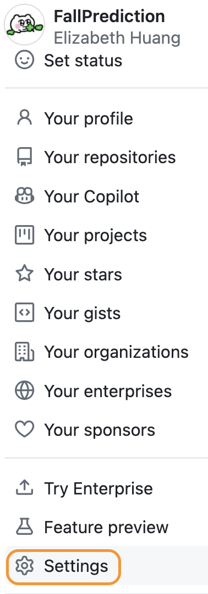
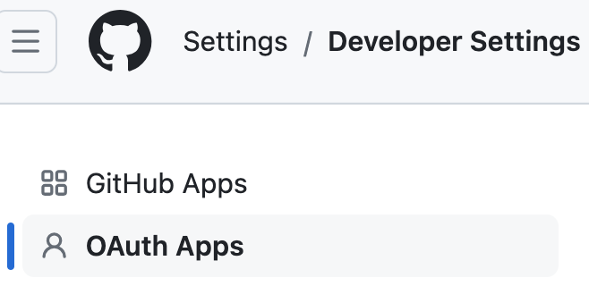
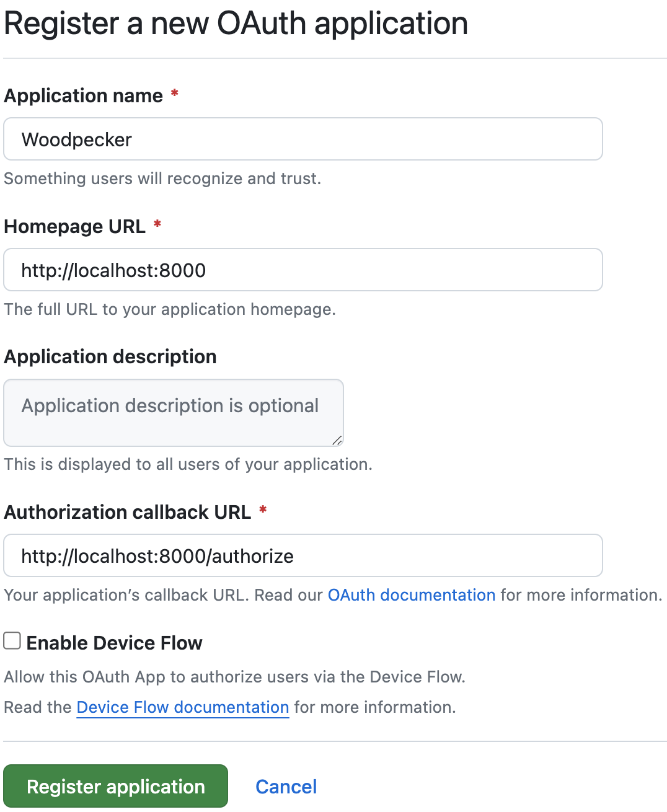
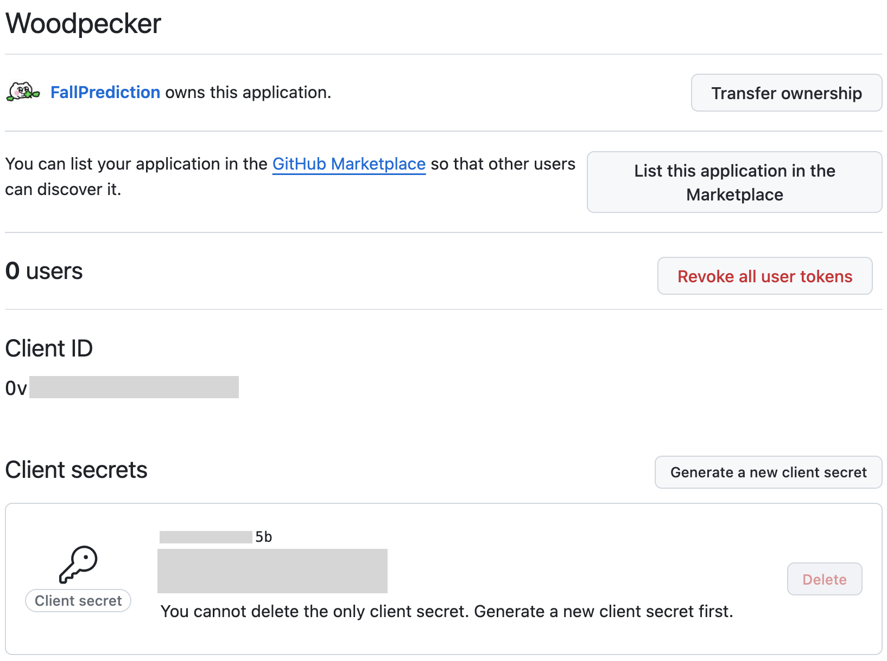
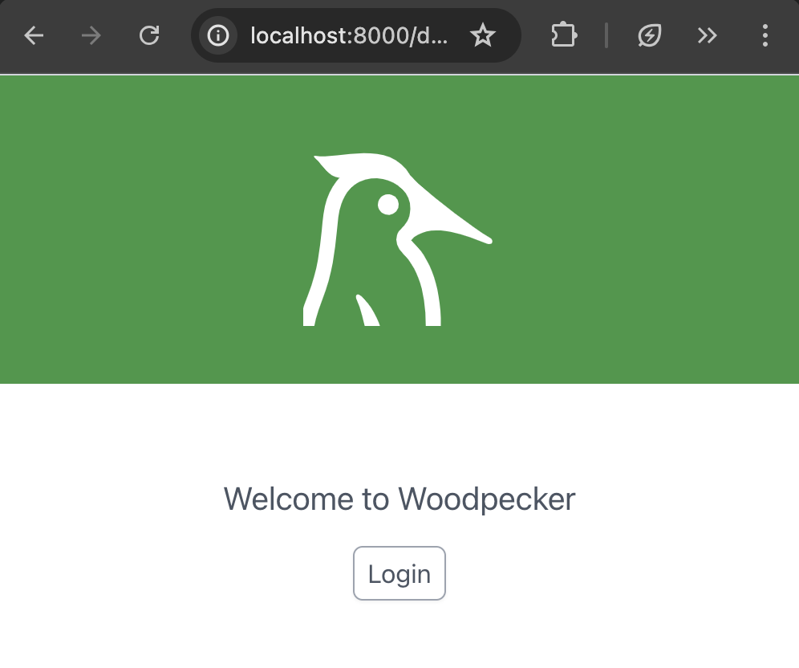
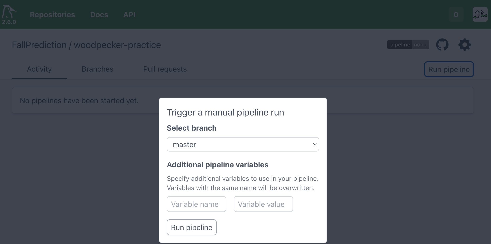
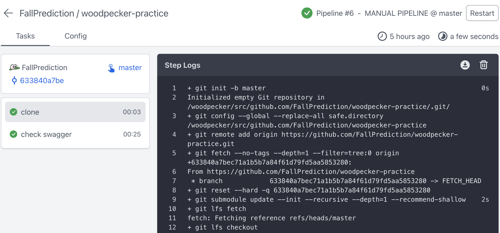
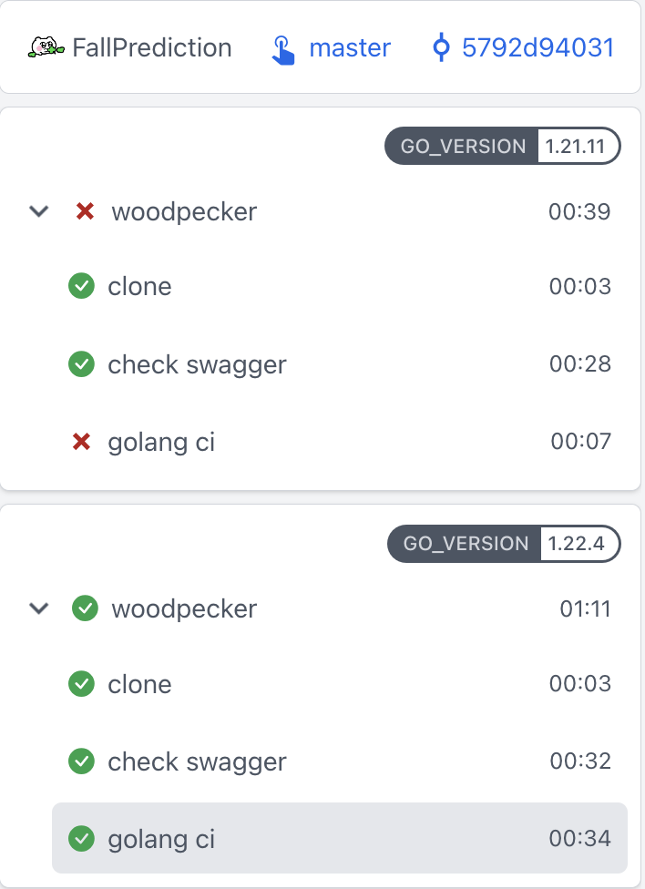

+++
title = 'Woodpecker，一款很新的 CI CD 工具'
date = 2024-06-27T19:38:38+08:00
draft = false
description = '又小又簡單，可以在本地執行，可以使用插件的 CI 工具'
toc = true
tags = ['CI/CD']
categories = ['CI/CD']
+++

Woodpecker 是一款簡單的 CI/CD 工具，基於 container 處理 pipeline

雖然非常小眾，但如果想要又小又簡單，可以在本地執行，可以使用插件的 CI 工具，那 Woodpecker 是個新選擇

## 架構


- [Forge](https://en.wikipedia.org/wiki/Forge_(software))：Github, GitLab等。發PR等 event 可觸發 Woodpecker pipeline
- Server：核心，負責與Forge溝通、提供使用者介面（User 可以透過瀏覽器使用）、透過gRPC與Agent溝通
- Agent：負責執行pipeline的workflow。多個 Agent 可以並行處理多個 workflow

注意，Woodpecker 必須被安裝在可以被公共網路（public internet）存取的地方，否則無法觸發 Webhook event。如果想當免費仔，可以在本地安裝，手動觸發 pipeline


- Pipeline：由一些workflow組成。由push, tag等事件觸發
- Workflow：一組動作(step)組成的某種功能。可以有多個 workflow 檔，但 artifact 只在 step 能夠互相存取，workflow 之間無法互相存取，需要借助 AWS S3 等外部儲存空間
- Service：在執行 step 時會需要用到的服務。例如許多 Web 專案會用到的 Redis, DB 等等
- Matrix：矩陣。Woodpecker 會使用每種組合執行一次 workflow。例如定義了兩種 GO 版本和兩種 Redis 版本，那組合共有四種(2 * 2 = 4)。在測試版本相容性的時候很好用
- Plugin：可以從[官方商店](https://woodpecker-ci.org/plugins)找能用的Plugin。另外因為 Woodpecker 是從 Drone fork 出來的，因此也可以用 [Drone 的 Plugin](https://plugins.drone.io/) ，但有可能需要微調。官方範例裡的`plugin/slack`就是用 Drone 的 Plugin

## Forge
### Github
注意要使用 Woodpecker 的 Repository，可以是private，但該帳號必須擁有這個 Repository 的權限，如果這個帳號是 Contributor，就無法在這個專案上使用

要連接到 Github，必須先取得 OAuth Client ID 和 Secret。下面介紹如何取得

登入 Github 後，點擊右上角的頭像，選擇 Settings



進入 Settings 後選擇 Developer Settings



新增 OAuth APP，然後填入資料

`Homepage URL`就是Woodpecker的FQDN，如`https://wookpecker.example.com`

`Authorization callback URL`就是`Homepage URL`加上`/authorize`



建立好 APP 後，需要建立 Client secret，然後記下 Client ID 和 Client secret，安裝的時候會用到



## Docker compose 安裝
官方有提供多種安裝方法，如 Docker、K8S、二進制檔

可以安裝在本地或是 VPS 等 Server 上，這邊示範在本地透過 Docker compose 安裝

首先，產生`WOODPECKER_AGENT_SECRET`，用於 Server 和 Agent 之間通訊的 Key

使用以下命令產生用十六進制輸出的32位元組的隨機字串
```
openssl rand -hex 32
```

再來建立 compose.yaml
```yaml
# compose.yaml
version: '3'

services:
  woodpecker-server:
    image: woodpeckerci/woodpecker-server:latest
    ports:
      - 8000:8000
    volumes:
      - woodpecker-server-data:/var/lib/woodpecker/
    environment:
      # Forge 中每個帳號都可以登入 Woodpecker
      - WOODPECKER_OPEN=true
      # 需要設FQDN，如https://wookpecker.example.com
      - WOODPECKER_HOST=${WOODPECKER_HOST}
      # Forge 使用 Github
      - WOODPECKER_GITHUB=true
      # Github OAuth client ID
      - WOODPECKER_GITHUB_CLIENT=${WOODPECKER_GITHUB_CLIENT}
      # Github OAuth secret
      - WOODPECKER_GITHUB_SECRET=${WOODPECKER_GITHUB_SECRET}
      # 剛才產生的隨機字串
      - WOODPECKER_AGENT_SECRET=${WOODPECKER_AGENT_SECRET}

  woodpecker-agent:
    image: woodpeckerci/woodpecker-agent:latest
    command: agent
    restart: always
    depends_on:
      - woodpecker-server
    volumes:
      - /var/run/docker.sock:/var/run/docker.sock
    environment:
      - WOODPECKER_SERVER=woodpecker-server:9000
      # 剛才產生的隨機字串
      - WOODPECKER_AGENT_SECRET=${WOODPECKER_AGENT_SECRET}

volumes:
  woodpecker-server-data:
```
`WOODPECKER_HOST`與 Github OAuth 的`Homepage URL`相同，是 FQDN，如https://wookpecker.example.com

`WOODPECKER_GITHUB_CLIENT`和`WOODPECKER_GITHUB_SECRET`就是剛才建立 Github OAuth 取得的兩個字串

Docker compose 可以讀取 `.env` file，這些變數可以貼在裡面就好
```
# .env
WOODPECKER_HOST=http://localhost:8000
WOODPECKER_GITHUB_CLIENT=
WOODPECKER_GITHUB_SECRET=
WOODPECKER_AGENT_SECRET=
```

設定完成後，啟動 Woodpecker
```
docker-compose up -d
```

## Try it out
#### 準備試用的 Repository
首先準備一個 Repository 來試用 Woodpecker

這邊複製了 [swaggo 的 Example](https://github.com/swaggo/swag/tree/master/example/basic)，需求檢查 swagger file 是否有忘記更新的情況

### .woodpecker.yaml
建立好專案後，在根目錄建立`.woodpecker.yaml`（實際上可以有好幾個workflow檔，這邊為求簡單只建立一個檔案）

多行 commands 可以用列點的方式，Woodpecker 會依次執行。如果有比較複雜的情況，可以寫一個腳本由 command 執行

以下 command 表示：
1. 安裝swag
2. 將 swagger json 和 yaml file 的 checksum 輸出成變數
3. 更新 swagger files
4. 將更新後的 swagger json 和 yaml file 的 checksum 輸出成變數
5. 比對是否一致，不一致的話 exit 1
```yaml
steps:
  - name: check swagger
    image: golang
    commands:
      - go install github.com/swaggo/swag/cmd/swag@latest
      - export SWAGGER_JSON_CHECKSUM_BEFORE=$(md5sum docs/swagger.json | cut -d ' ' -f 1)
      - export SWAGGER_YAML_CHECKSUM_BEFORE=$(md5sum docs/swagger.yaml | cut -d ' ' -f 1)
      - swag init
      - export SWAGGER_JSON_CHECKSUM_AFTER=$(md5sum docs/swagger.json | cut -d ' ' -f 1)
      - export SWAGGER_YAML_CHECKSUM_AFTER=$(md5sum docs/swagger.yaml | cut -d ' ' -f 1)
      - if [ "$SWAGGER_JSON_CHECKSUM_BEFORE" != "$SWAGGER_JSON_CHECKSUM_AFTER" ]; then exit 1; fi
      - if [ "$SWAGGER_YAML_CHECKSUM_BEFORE" != "$SWAGGER_YAML_CHECKSUM_AFTER" ]; then exit 1; fi
      - exit 0
```
設定好後，push 到 Repo

### Dashboard
http://localhost:8000 進入 Dashboard


點擊 Login 後，會要求 OAuth 認證，點擊 Authorize

登入以後，點擊 Add repository 按鈕，選擇剛才建立的 Repository，點選Enable

要手動觸發 pipeline，點擊 Run pipeline 按鈕，然後選擇 branch 並執行



執行結果
可以看到 pipeline 的第一個步驟都是 clone 專案，因此不需要在 .woodpecker.yaml 裡面寫 clone code 的步驟


## 試試 Matrix
我們先在`main`裡面加上這幾行
```go
import (
	"fmt"
	// ...
)
func main() {
	for i := range 10 {
		fmt.Println(10 - i)
	}
	fmt.Println("go1.22 has lift-off!")
	// ...
}
```
這個只有在 GO 1.22 裡面才會正常執行

然後修改`.woodpecker.yaml`，加上 golint 檢查，以及matrix
```yaml
# .woodpecker.yaml
steps:
  # ...
  - name: golang ci
    image: golang:${GO_VERSION}
    commands:
      - curl -sSfL https://raw.githubusercontent.com/golangci/golangci-lint/master/install.sh | sh -s -- -b $(go env GOPATH)/bin v1.59.1
      - golangci-lint --version
      - golangci-lint run

matrix:
  GO_VERSION:
    - 1.21.11
    - 1.22.4
```

再次手動執行，可以很清楚地看到 GO 1.21.11 的版本會噴錯



另外，如果有多個 agent，多個 matrix 可以並行執行，節省時間！~~金錢的力量~~

## Wrap up
Github action 有免費好用的每月額度，小小的個人專案可以輕鬆達到 CI/CD 的功能；而 Woodpecker 的主動權在使用者身上，可以自己選擇機器，只需要機器的錢， pipeline 可以無限次執行，甚至可以有更進階的自定義功能

本篇的範例 Code 在[我的 Github repository](https://github.com/FallPrediction/woodpecker-practice)

